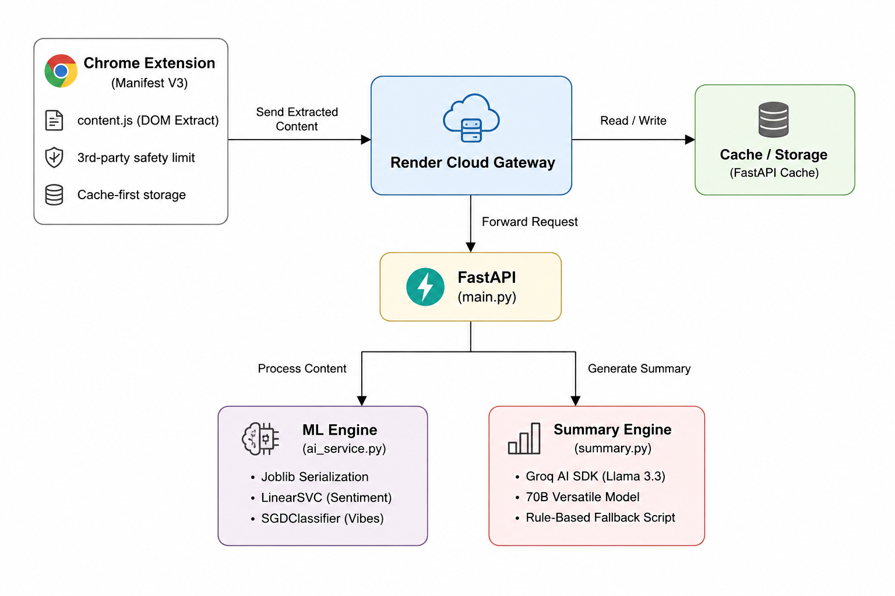

# 🎬 MovieMind AI

> **Real-Time IMDb Sentiment & Vibe Analyzer**  
> A lightweight Chrome Extension that extracts, analyzes, and summarizes audience sentiment and emotional "vibes" directly from IMDb reviews.


---

## 📖 Table of Contents

- [Overview](#-overview)
- [System Architecture](#-system-architecture)
- [Core Features](#-core-features)
- [Tech Stack](#-tech-stack)
- [How It Works](#-how-it-works)
- [Local Setup & Installation](#-local-setup--installation)
- [Cloud Deployment](#️-cloud-deployment-render)
- [API Documentation](#-api-documentation)
- [License & Contact](#-license--contact)

---

## 🚀 Overview

**MovieMind AI** combines traditional Machine Learning with modern Generative AI to analyze IMDb audience reviews in real time.

The Chrome Extension extracts up to **350 audience reviews** directly from an IMDb movie page. These reviews are sent to a FastAPI backend where lightweight Machine Learning models analyze:

- 👍 Positive and negative sentiment
- 🎭 Emotional movie vibes
- 📊 Overall audience opinion
- 🤖 AI-generated review summaries

Instead of relying on large transformer models for classification, MovieMind AI uses lightweight `scikit-learn` algorithms such as **LinearSVC** and **SGDClassifier**, serialized using `joblib`.

The analyzed statistics are then passed to **Groq's Llama 3.3 70B model**, which generates a natural-language summary of audience reactions.

This hybrid architecture provides fast inference while keeping server resource requirements low.

---

## 🏗 System Architecture

<p align="center">
  
</p>

### Architecture Flow

```text
IMDb Movie Page
      │
      ▼
Chrome Extension
      │
      │ Extract Reviews
      ▼
Render Cloud Gateway
      │
      ▼
FastAPI Backend
      │
      ├──────────────► ML Engine
      │                 ├── LinearSVC → Sentiment
      │                 └── SGDClassifier → Vibes
      │
      └──────────────► Summary Engine
                        ├── Groq Llama 3.3 70B
                        └── Rule-Based Fallback
```

---

## ✨ Core Features

### 🧠 CPU-Efficient Machine Learning

Uses lightweight `LinearSVC` and `SGDClassifier` models for rapid NLP classification without requiring GPU-based cloud infrastructure.

### 🎭 Sentiment & Vibe Detection

Analyzes IMDb audience reviews to identify:

- Positive sentiment
- Negative sentiment
- Funny
- Exciting
- Heartwarming
- Emotional
- Scary
- Frustrating
- Mind-blowing

### 🤖 AI-Generated Audience Summary

Aggregated sentiment and vibe statistics are passed to the **Groq API** using:

`llama-3.3-70b-versatile`

The LLM converts the numerical analysis into a readable critic-style audience summary.

### 🛡️ Resilient Summary Generation

If the Groq API becomes unavailable or hits a rate limit, MovieMind AI automatically switches to a **rule-based fallback summary generator**.

This allows the extension to continue providing results even when the external LLM service is unavailable.

### ⚡ Browser Memory Protection

The extension limits extraction to a maximum of **350 reviews per analysis cycle**, reducing unnecessary DOM processing and memory consumption.

### 💾 Cache-First Processing

Previously analyzed movie information can be stored locally, reducing repeated backend requests and improving perceived response time.

### 📦 Lightweight Model Deployment

Machine Learning models are serialized using `joblib`, allowing them to load quickly when the FastAPI application starts.

### ☁️ Cloud Deployment

The backend is designed to run as a lightweight **Render Web Service**, making the system accessible directly from the Chrome Extension.

---

## 💻 Tech Stack

| Domain | Technologies |
|---|---|
| **Browser Extension** | JavaScript, HTML, CSS, Chrome Extension API |
| **Extension Standard** | Manifest V3 |
| **Backend** | Python, FastAPI, Uvicorn |
| **Machine Learning** | Scikit-Learn |
| **Sentiment Model** | LinearSVC |
| **Vibe Model** | SGDClassifier |
| **NLP** | NLTK |
| **Model Serialization** | Joblib |
| **Generative AI** | Groq API |
| **LLM** | Llama 3.3 70B Versatile |
| **Deployment** | Render |
| **Version Control** | Git, GitHub |

---

## 🔄 How It Works

1. The user opens an **IMDb movie page**.

2. MovieMind AI extracts audience reviews directly from the page DOM using `content.js`.

3. Review extraction is limited to **350 reviews** to prevent unnecessary browser memory usage.

4. The extension sends the extracted reviews to the **FastAPI backend** hosted on Render.

5. The **ML Engine** preprocesses and analyzes each review.

6. `LinearSVC` predicts whether each review has **positive or negative sentiment**.

7. `SGDClassifier` predicts the dominant emotional **vibe** of each review.

8. FastAPI aggregates the classification results into percentages and statistics.

9. The aggregated results are sent to **Groq Llama 3.3 70B**.

10. The LLM generates a concise natural-language summary describing the overall audience reaction.

11. If Groq is unavailable, the **rule-based fallback system** generates the summary locally.

12. The final results are displayed inside the MovieMind AI interface.

---

## 🛠 Local Setup & Installation

### 1. Clone the Repository

```bash
git clone https://github.com/yourusername/MovieMind-AI.git
cd MovieMind-AI
```

---

### 2. Backend Service Initialization

Navigate to the backend directory:

```bash
cd backend
```

Create a virtual environment:

```bash
python -m venv venv
```

Activate it.

#### Windows

```bash
venv\Scripts\activate
```

#### Linux / macOS

```bash
source venv/bin/activate
```

Install dependencies:

```bash
pip install -r requirements.txt
```

---

### 3. Configure Environment Variables

Create a `.env` file inside the `/backend` directory:

```env
GROQ_API_KEY=your_groq_api_key_here
```

> ⚠️ Never commit your `.env` file or API keys to GitHub.

Make sure `.env` is included in `.gitignore`:

```gitignore
.env
venv/
__pycache__/
*.pyc
```

---

### 4. Start the FastAPI Server

```bash
uvicorn main:app --reload --host 0.0.0.0 --port 8000
```

The backend should now be available at:

```text
http://localhost:8000
```

FastAPI Swagger documentation:

```text
http://localhost:8000/docs
```

---

## 🧩 Chrome Extension Installation

1. Open Google Chrome.

2. Navigate to:

```text
chrome://extensions/
```

3. Enable **Developer Mode**.

4. Click **Load unpacked**.

5. Select the `/extension` directory from the MovieMind AI repository.

6. Pin **MovieMind AI** to your browser toolbar.

7. Open an IMDb movie page and run the analyzer.

---

## ☁️ Cloud Deployment (Render)

MovieMind AI's FastAPI backend can be deployed as a **Render Web Service**.

### 1. Create Web Service

Connect your GitHub repository to Render and create a new Web Service.

### 2. Build Command

```bash
pip install -r backend/requirements.txt
```

### 3. Start Command

```bash
cd backend && uvicorn main:app --host 0.0.0.0 --port $PORT
```

### 4. Environment Variables

Add the following environment variable in the Render dashboard:

```env
GROQ_API_KEY=your_groq_api_key
```

### 5. Update Chrome Extension

Update your `manifest.json` host permissions and backend `fetch()` URLs to use your deployed Render endpoint.

Example:

```text
https://your-app-name.onrender.com
```

---

## 📡 API Documentation

### Analyze Reviews

Processes an array of IMDb review strings and returns sentiment, vibe statistics, and an AI-generated summary.

### Endpoint

```http
POST /api/analyze
```

### Headers

```http
Content-Type: application/json
```

### Request Body

```json
{
  "reviews": [
    "This movie was an absolute masterpiece with stunning visuals.",
    "The pacing was terrible and I fell asleep halfway through."
  ]
}
```

### Example Response

```json
{
  "status": "success",
  "metrics": {
    "total_analyzed": 2,
    "positive_pct": 50.0,
    "negative_pct": 50.0,
    "top_vibes": [
      "Exciting",
      "Frustrating"
    ]
  },
  "summary": "Audience reactions are divided. While some viewers praise the movie's visual presentation, others criticize its pacing and overall engagement."
}
```

---

## 📂 Suggested Project Structure

```text
MovieMind-AI/
│
├── extension/
│   ├── manifest.json
│   ├── content.js
│   ├── popup.html
│   ├── popup.js
│   └── styles.css
│
├── backend/
│   ├── main.py
│   ├── ml_service.py
│   ├── summary.py
│   ├── requirements.txt
│   └── models/
│
├── assets/
│   └── architecture.png
│
├── README.md
├── LICENSE
└── .gitignore
```

---

## 📜 License & Contact

Distributed under the **MIT License**. See `LICENSE` for more information.

**Author:** Mohit Gupta

**Email:** mg53689@gmail.com

---

<p align="center">
  Made with ❤️ using Python, Machine Learning & Generative AI
</p>

<p align="center">
  ⭐ If you found MovieMind AI useful, consider starring the repository!
</p>